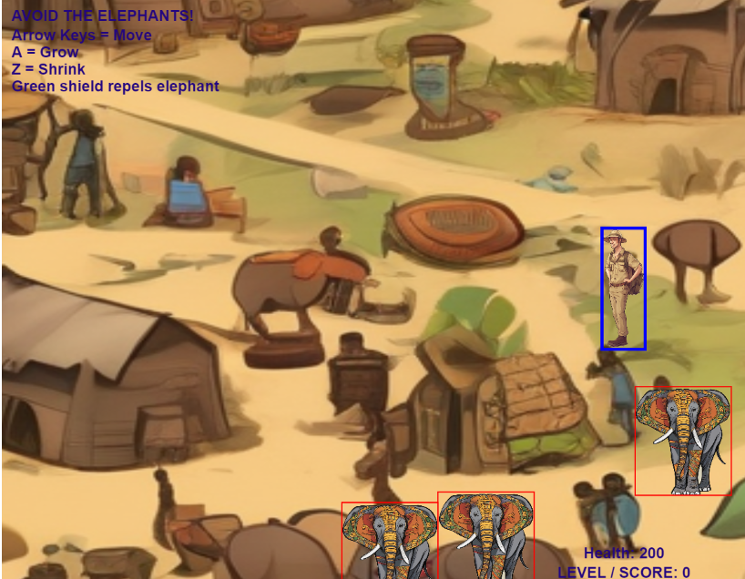

# african-village-game

## Overview

Created as a scene for another game. The player can look around an African village by using the arrow keys while avoiding being stampeded by elephants. A shield protects them from the elephants and a health score is kept. 

## Internship Project

This game is developed as part of an internship project, with the main goal of creating an impactful and informative game using Rosebud AI and the Phaser game framework. 

## Technology Stack
#### Rosebud AI: Utilized for generating assets and enhancing the creative process.
#### Phaser: A powerful framework for developing 2D games, used to build and run the game.
#### Image editing software.

## Deployed link:

https://vickysug.github.io/african-village-game/  (Note: The background image is blurry in the deployed GitHub link, still working on it.)

## Live on RosebudAi:

https://play.rosebud.ai/games/579d4adb-c409-4e38-8c87-007ba4cb8f84

## Application Screenshot 

## License

This project is licensed under the MIT License. See the LICENSE file for more details.

## Acknowledgements
Special thanks to the Rosebud AI team for their support and resources.

